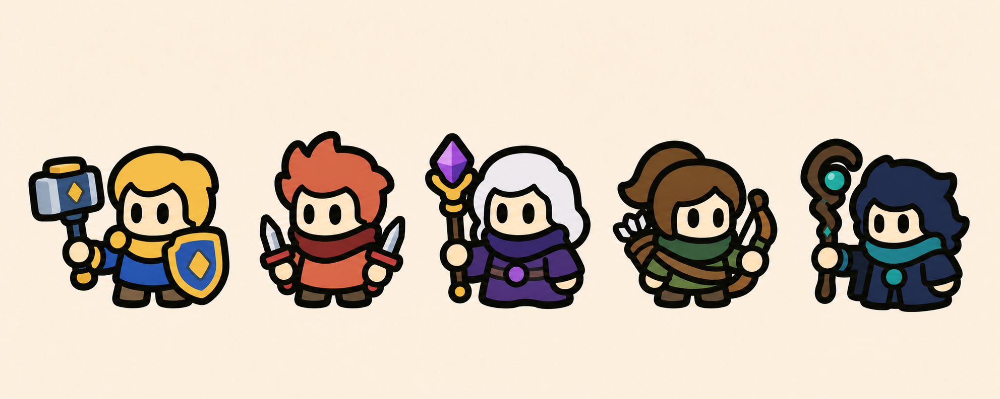

# H5 放置 RPG 角色美术设计规范

- 版本：1.0
- 状态：历史参考
- 确认日期：2026-07-31
- 适用范围：英雄、类人 NPC、类人敌人的标准角色形象图
- 权威视觉参考：[hero-style-master-v1.png](../../art/references/hero-style-master-v1.png)

> 当前项目已改为先使用独立 SVG 单角色素材搭建玩法，正式美术后续采用“一名英雄一张完整单图”，不再进行种族与职业模块拼装。  
> 当前角色比例、侧身方向、SVG 规则及总体框架以 [`2026-07-31-core-game-framework-design.md`](./2026-07-31-core-game-framework-design.md) 为准；本文件仅保留早期视觉研究记录。



## 1. 目标

角色采用简约、粗线条、低细节的休闲卡通语言。角色需要像可直接投入战斗的小棋子：头部大、身体短、轮廓清晰，小尺寸下仍能通过头型、主色和武器识别身份。

后续所有角色形象图必须以本项目的权威视觉参考为首要风格输入。第三方游戏截图只用于前期方向研究，不得继续作为生产素材、直接生成参考或交付内容。

本规范不包含 UI、场景和技能特效的详细规则。非类人怪物与 Boss 可以继承线条、色彩和细节密度，但需要单独确认其身体结构。

## 2. 核心视觉语言

### 2.1 整体印象

- 休闲卡通，而非精致日系 Q 版。
- 像手绘贴纸或游戏棋子，而非写实插画。
- 形状优先于纹理，轮廓优先于服装细节。
- 允许轻微不对称和圆润的不规则曲线，但不能显得潦草。
- 角色在 80–120 px 高度下仍能辨认职业和武器。

### 2.2 禁止方向

- 写实人体、长腿或明确肌肉结构。
- 2.5 头身以上的常规 Q 版比例。
- 日系头发丝、复杂五官或夸张表情。
- 写实金属、材质纹理、柔和厚涂、复杂渐变。
- 多层盔甲、密集腰带、扣件、花边或衣服纹样。
- 过大的武器、盾牌或法杖压过人物主体。
- 过于规整的矢量几何感。
- 复制其他游戏的角色、武器、纹章或服装设计。

## 3. 身体比例

| 部位 | 规范 |
| --- | --- |
| 总体比例 | 约 1.6–1.9 头身 |
| 头部 | 包含头发或帽子时，占角色总高约 48–55% |
| 颈部 | 不表现，头部直接连接身体 |
| 躯干 | 一个紧凑主体块，占总高约 30–36% |
| 腿部 | 两个独立短桩，占总高约 8–12% |
| 手部 | 两个可见圆形，不画手指，直径约为头宽的 16–22% |

角色不预设坦克、治疗或前后排体型。角色的自然站位由攻击距离和技能决定，美术只负责通过外形表达身份。

## 4. 脸部与头部

### 4.1 脸部

- 脸型为圆形或轻微软方形。
- 只保留两只黑色竖椭圆眼睛。
- 禁止嘴巴、鼻子、眉毛、睫毛、腮红和表情线。
- 两只眼睛大小一致，位置接近脸部垂直中线。
- 不依赖面部表情表达性格，改用姿态、颜色和装备表达。

### 4.2 头发与帽子

- 头发、兜帽、头盔或法帽必须是单一大轮廓。
- 外轮廓转折控制在 3–7 个主要节点。
- 禁止绘制发丝、碎发、高光条和多层帽檐纹样。
- 每名英雄最多保留一个有辨识度的头部特征。

## 5. 线条规范

- 外轮廓颜色默认使用近黑暖色 `#1B1D18`，允许在 `#171A16` 至 `#2B2521` 范围内微调。
- 外轮廓宽度约为头宽的 7–9%。
- 内部分隔线宽度为外轮廓的 60–70%。
- 线条端点和转角使用圆头、圆角。
- 外轮廓必须连续、闭合、清楚；禁止双描边和细碎毛边。
- 武器、头部和身体使用最粗外轮廓；脸部与服装分隔使用较细内部线。
- 缩到 96 px 高时，如果某条线低于 2 px 或某个色块低于 4 px，应删除该细节。

## 6. 色彩与明暗

### 6.1 单角色配色

每名角色控制在 4–6 个主要可见颜色，不包含描边色：

1. 一个职业主色，占角色可见面积约 55–70%。
2. 一个辅助色，占约 20–30%。
3. 一个强调色，占比不超过 10%。
4. 肤色。
5. 必要时增加一个武器或法术颜色。

同一队伍中的角色主色应明显区分，避免五名英雄缩小后混成同一色块。

### 6.2 明暗

- 以纯色色块为主。
- 每个主要物体最多增加一块硬边暗面。
- 禁止复杂渐变、写实反光和环境光染色。
- 宝石、冰晶、法球可以使用一个高光块，但不能产生玻璃或金属写实感。
- 稀有度不得通过增加渲染复杂度表达，应使用强调色、外框和少量符号表达。

## 7. 服装与职业识别

- 躯干使用一个主色块。
- 围巾、披风、腰带或胸甲最多选择其中两个作为辅助结构。
- 每名角色最多保留一个头部识别点和一个身体识别点。
- 禁止用密集纽扣、腰包、铆钉、花边和图案表达职业。
- 职业主要通过以下顺序识别：

  1. 武器或法器；
  2. 头发、帽子、兜帽或头盔；
  3. 主色；
  4. 一个身体辅助结构。

## 8. 武器规范

武器需要清楚，但不能压过人物。

| 类型 | 建议尺寸 |
| --- | --- |
| 匕首、短剑、单手锤 | 角色总高的 45–60% |
| 法杖、长弓、长柄武器 | 角色总高的 55–70% |
| 盾牌 | 角色总高的 32–42% |

补充规则：

- 长武器可以略高于头顶，但不得超过角色总高的 10%。
- 武器不得明显低于角色脚底。
- 每件武器使用 2–4 个主要结构表达，例如刃面、护手、握柄和宝石。
- 不绘制密集刻纹、铆钉、锯齿和多层装饰边。
- 武器握柄应穿过圆形手部或由圆手覆盖，不能出现写实手指。
- 双持角色仍需保持身体轮廓完整，左右武器不得遮住整个躯干。

## 9. 标准构图

### 9.1 角色标准图

- 画布：1024 × 1024 px。
- 输出：透明背景 PNG。
- 角色占画布高度约 72–80%。
- 四周安全边距不低于画布的 10%。
- 默认使用正面偏三分之四视角，并朝画面右侧。
- 全身完整可见，不裁切头饰、手、脚和武器。
- 双手尽量可见；被盾牌遮挡时，至少要清楚表现持握关系。
- 脚底使用统一基线，禁止投影成为角色轮廓的一部分。

### 9.2 界面裁剪

- 英雄列表、头像和召唤界面均从同一标准图裁剪。
- 不为头像重新设计五官、头发和颜色。
- 小图标裁剪时优先保留头部与武器识别点。
- 战斗显示目标高度为 80–120 px，Boss 可以放大到英雄的 1.4–1.8 倍。

## 10. 图片生成工作流

### 10.1 角色输入卡

生成前必须先填写：

- 角色名称；
- 身份或战斗概念；
- 攻击距离；
- 主武器；
- 主色、辅助色和强调色；
- 唯一头部特征；
- 唯一身体特征；
- 必须避免的相似角色。

不使用“前排”“后排”“必须坦克”或“必须治疗”作为造型限制。攻击距离只影响武器与动作表达。

### 10.2 生成顺序

1. 将权威参考图作为风格参考输入。
2. 生成单名角色的中性标准姿势，不先生成动作帧。
3. 检查轮廓、比例、脸部、手脚和武器尺寸。
4. 选定角色后，将选定图作为该角色后续图像的身份参考。
5. 再制作透明标准图、头像裁剪和动作图。
6. 后续修订只允许一次修改一个变量，例如武器尺寸或主色，避免角色身份漂移。

### 10.3 标准生成提示词模板

```text
Use case: stylized-concept
Asset type: original character master art for a mobile H5 idle RPG
Input image: use hero-style-master-v1.png only as the authoritative style reference for proportions, outline weight, flat-color rendering and detail density. Do not copy any existing character.

Create one completely original fantasy character:
- Name/concept: {name_and_concept}
- Attack distance: {attack_distance}
- Weapon: {weapon}
- Main palette: {main_color}, {secondary_color}, {accent_color}
- Unique head feature: {head_feature}
- Unique body feature: {body_feature}

Style:
- very compact 1.6–1.9 head-tall casual cartoon game piece
- huge rounded or softly squared head, no neck, tiny torso
- exactly two black oval eyes
- absolutely no mouth, nose, eyebrows, eyelashes or facial expression lines
- two visible circular hands with no fingers
- two extremely short rounded stub legs
- extra-thick near-black warm outlines, rounded line ends
- simple flat color blocks with at most one hard-edged shadow per major object
- weapon readable but restrained: 55–70% of character height as appropriate
- clothing uses one torso block and no more than two auxiliary blocks
- front three-quarter view, facing right, full body, neutral pose
- plain removable background, generous padding

Avoid:
polished anime chibi, long limbs, realistic anatomy, hair strands, layered armor,
ornamental costume borders, tiny buckles, painterly shading, complex gradients,
metallic reflections, oversized weapons, vector-perfect geometry, text, logo, watermark.
```

## 11. 交付物与命名

每名确认角色至少交付：

- 标准透明角色图：1024 × 1024 PNG；
- 游戏运行图：512 px WebP；
- 英雄列表图：256 px WebP；
- 头像裁剪图：256 × 256 WebP；
- 角色生成说明：角色输入卡和最终提示词。

命名格式：

```text
hero_<角色ID>_master_v01.png
hero_<角色ID>_runtime_v01.webp
hero_<角色ID>_portrait_v01.webp
hero_<角色ID>_prompt_v01.md
```

修改角色设计时增加版本号，不覆盖已确认版本。

## 12. 验收清单

角色只有在以下项目全部通过后才能成为后续动作和界面素材的母版：

- [ ] 与权威参考处于同一粗线条、短身体、低细节语言。
- [ ] 角色约为 1.6–1.9 头身。
- [ ] 脸部只有两只黑色椭圆眼睛，没有其他五官。
- [ ] 两只手都是圆形，没有手指。
- [ ] 腿部是两个清楚的短桩。
- [ ] 外轮廓比内部分隔线明显更粗。
- [ ] 缩到 96 px 高时仍能识别角色和武器。
- [ ] 武器没有压过头部和身体主体。
- [ ] 躯干没有超过两个辅助服装结构。
- [ ] 单角色主要颜色控制在 4–6 个。
- [ ] 没有复杂纹理、渐变、写实材质或精致 Q 版细节。
- [ ] 角色、武器、纹章和服装均为原创。
- [ ] 透明边缘无白边、黑边或背景残留。

## 13. 版本管理

`hero-style-master-v1.png` 是 1.0 版本的唯一权威角色风格参考。后续若修改头身比例、五官、线宽、武器尺寸或渲染方式，必须：

1. 生成新的对照样张；
2. 获得确认；
3. 保存为新的 `hero-style-master-v2.png`；
4. 更新本文档版本号与变更记录；
5. 不追溯修改已经确认并投入使用的旧角色。
