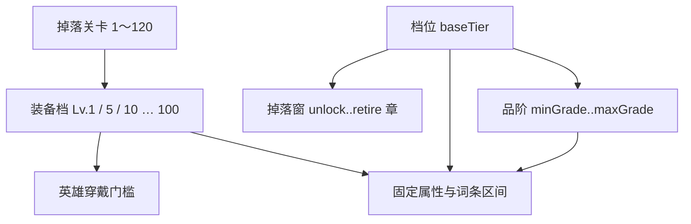

# 装备系统定版：装备等级 + 分档底板 + 十品阶

> **日期：** 2026-08-10  
> **状态：** **装备等级模型已定版**（等级管门槛与数值区间，品质管词条与特殊能力）  
> **对标：** TBH（品阶色与同名变色）+ 暗黑（橘字/套装）+ 长线手游（主线/秘境/每日/爬塔）

---

## 0. 一页说清（请先读这里）

### 0.1 核心规则

1. **一件装备定义 = 一个固定名字 + 一张图标**（掉落变色、不变名换图）。  
2. **装备等级使用固定 5 级档**：Lv.1 为新手档，之后只有 Lv.5、10、15……100；英雄达到同等级后才能穿戴。  
3. **每件定义有底板档位**：决定「哪几章会掉」和「最高/最低能出什么品阶」，只提供小幅底板差。  
4. **分档 + 品阶帽**：低档装（如铁剑）只在前期掉、最高良品；**混元永不自然掉落**（对齐 TBH 顶格）。  
5. **关卡只决定掉落档位**：120 个关卡先映射到角色等级，再向下归入最近的 5 级装备档，不会产生随意的 Lv.7、Lv.13 等装备。  
6. **物法可混穿**；套装靠 `setId`，和品阶无关。
7. **炼金台独立成长**：九件同等级、同品阶装备升一品阶，产物等级不得超过炼金台当前上限。



### 0.2 「铁剑」 contra 「霜牙」示例

| | 铁剑（T1） | 霜牙弯刀（T2） | 毕业刀（T4） |
|---|---|---|---|
| 主线掉落 | **仅 Ch1** | Ch2～Ch4 | Ch7～Ch10 + 秘境 |
| 品阶 | 凡品～**良品** | 凡品～**传奇** | 凡品～**神辉**（混元仅合成） |
| 底座 | baseTier=1 | baseTier=2 | baseTier=4 |
| 橘字 | 通常无 | 可有 | 强橘字 |
| 套装 | 通常无 | 过渡套可选 | 毕业套 |

同一次掉落：先按章选「还在掉落窗内」的定义 → 再在该定义的 min～max 品阶里掷色 → 再算预算。

### 0.4 首版内容：主线定为 **10 章**

Demo 已实现 Ch1–4 可玩；**产品规划至少 10 章**。  
命名对齐 **《魔兽世界》中文区域感**：短地名、地貌清楚，少用「幽径、归墟、天门、云海」等偏口号/仙侠的词。

**原则：** 像「艾尔文森林 / 西部荒野 / 燃烧平原 / 湿地 / 风暴峭壁 / 北风苔原」；不像「雾沼幽径 / 归墟天门」。

| 章 | 定名 | 地貌 | 装备档 | 工程 |
|---:|---|---|---|---|
| 1 | **青丘林地** | 林地与村落 | T1 | 现用「青丘边境」，建议更名 |
| 2 | **霜风谷** | 雪谷冻河 | T2 | 现用「霜原」，建议更名 |
| 3 | **赤沙荒地** | 沙漠干河 | T2 | 现用「赤沙古道」，建议更名 |
| 4 | **雷崖高地** | 高崖雷暴 | T2～T3 | 现用「苍雷云海」，建议更名 |
| 5 | **黑水湿地** | 沼泽浅滩 | T3 | 规划 |
| 6 | **燃烧荒地** | 焦土岩脉 | T3 | 规划 |
| 7 | **暗潮海岸** | 岩岸潮汐 | T3～T4 | 规划 |
| 8 | **哀嚎丘陵** | 荒丘旧战场 | T4 | 规划 |
| 9 | **石牙山脉** | 石山矿道 | T4 | 规划 |
| 10 | **北风关隘** | 苦寒边关 | T4 | 规划 |

- 每章建议 **12 关** → 约 **120 关**。  
- `stage = (chapter - 1) × 12 + 章内关`。  
- Ch1–4 展示字符串可稍后统一替换；内容表以本表为准。  
- Ch5–10 分期实现；`unlockChapter` 按 1…10。

**掉落窗（10 章）：**

| baseTier | unlock～retire | 自然掉落品阶上限 |
|---:|---|---|
| 1 | Ch1～进 Ch2 退役 | ≤ 良品 |
| 2 | Ch2～Ch4 | ≤ 传奇 |
| 3 | Ch4～Ch7 | ≤ 灵蕴 |
| 4 | Ch7～Ch10 + 秘境/塔 | ≤ 神辉（混元仅合成，§0.5） |

### 0.5 最高品阶：对齐 TBH「几乎不掉顶格」

TBH 的 Divine / Cosmic（神圣/宇宙）正常游玩几乎拿不到，主要靠合成尾段。本作同样：

| 品阶 | 自然掉落 | 主要来源 |
|---|---|---|
| 凡品～星穹 | 可按档位/权重掉 | 主线、秘境、每日、爬塔 |
| **神辉** | 极稀（Boss/爬塔高层/高难秘境） | 同上，权重近 0 |
| **混元**（第 10 阶） | **主线与常规副本均不掉** | **仅 9 合 1 / 合成终点**（Phase B） |

因此：即使 T4「毕业」底板，实例最高自然色也到神辉；**不会出现关卡直接掉「混元 · xxx」**。  
UI 仍保留混元色与枚举，供合成产物与图鉴。

---

## 1. 目标与边界

| 要 | 不要 |
|---|---|
| **分档底板**：掉落窗 + min/max 品阶 + baseTier | 每件都能出满混元 |
| 同名在允许品阶内变色（TBH 色） | 升品改名换 definition |
| 物法软分类可混穿 | 硬限制穿不上 |
| 套装 2/4/6；秘境/每日定向 | 只靠主线凑齐所有套 |
| 超长章节线性 + 四柱规划 | Demo 一次做满秘境/每日/爬塔玩法 |
| 9 合 1 预留 | 本波必须上 Cube |

冲突时：本节 **§0 / §2** 覆盖本文旧表述「同 definition 全 10 品阶可出」「禁止低档封顶」。

## 2. 分档底板（正式模型）

### 2.1 数据字段

```ts
type DamageSchool = "physical" | "magic";
type Rarity =
  | "common" | "uncommon" | "rare" | "epic" | "immortal"
  | "arcane" | "transcendent" | "astral" | "sacred" | "primordial";

interface ItemDefinition {
  id: string;
  name: string;                 // 固定显示名
  icon: string;                 // 一图；品阶不换图
  slot: EquipmentSlot;
  school: DamageSchool;
  baseTier: 1 | 2 | 3 | 4;    // 强度档；也可扩到 1..12
  unlockChapter: number;        // 主线开始掉
  retireChapter: number;        // 主线从此章起不再掉（含该章）
  minGrade: Rarity;
  maxGrade: Rarity;
  setId?: string;
  // 传奇橘字：仅当掷出的 grade >= epic 且有绑定才出现
}

interface InventoryItem {
  definitionId: string;
  level: number;                 // 1～100；需求等级与数值区间
  stage: number;                 // 仅记录掉落来源，不再直接参与属性计算
  rarity: Rarity;
  // stats / affixes / traitId ...
}
```

### 2.2 四档总表（主线节奏锚）

| baseTier | 定位 | 主线掉落窗（10 章） | 品阶范围（例） | 套装/橘字 |
|---:|---|---|---|---|
| **1** | 入门 | Ch1（进 Ch2 退役） | 凡品～良品 | 无 |
| **2** | 过渡 | Ch2～Ch4 | 凡品～传奇 | 可弱橘字 |
| **3** | 成型 | Ch4～Ch7 | 凡品～灵蕴 | 套装件；橘字 |
| **4** | 毕业 | Ch7～Ch10 + 秘境/塔 | 凡品～**神辉**（混元不自然掉） | 毕业套；强橘字 |

`retireChapter` 例：T1 的 `unlockChapter=1, retireChapter=2` → 一进 Ch2 主线就不再掉铁剑。  
回刷 Ch1 仍可掉 T1（可选规则：回刷用「当前所在章」池，则回刷 Ch1 才掉铁剑）。

### 2.3 件数与分配（定义数 = 图标数）

```text
推荐：10 槽 × 2 school × 12 名 = 240 定义 = 240 图标
```

每槽 24 名建议按档切开（例）：

| baseTier | 每槽物理 | 每槽法系 | 说明 |
|---:|---:|---:|---|
| 1 | 2 | 2 | 入门脸，白绿 |
| 2 | 3 | 3 | 过渡 |
| 3 | 3 | 3 | 成型/套装 |
| 4 | 4 | 4 | 毕业/高品 |

（2+3+3+4=12。）十槽合计仍约 240。

### 2.4 装备等级与数值区间

```text
rawLevel = 1 + (dropStage - 1) × 99 / 119
itemLevel = rawLevel < 5 ? 1 : floor(rawLevel / 5) × 5

itemBudget = round(
  10 × 1.044^(powerStage(itemLevel) - 1)
  × rarityMultiplier[grade]
  × baseTierMultiplier[baseTier]   // 1.00 / 1.04 / 1.08 / 1.12
)

固定属性 = itemBudget × 部位系数 × roll[0.85, 1.15]
```

- **装备等级**是主强度轴，也是英雄穿戴门槛；合法档位只有 Lv.1、5、10、15……100。  
- **同等级、同品阶、同部位**：固定属性在 85%～115% 内波动，形成可刷的底值。  
- **固定数值词条**随装备等级预算增长；固定百分比词条也从 Lv.1 的 65% 区间逐步成长到 Lv.100 的完整区间。  
- **品阶**主要决定词条数量、传奇橘字与固定属性预算，不再额外放大百分比词条。  
- **底板档位**只保留 0%～12% 的款式差，避免“等级、品阶、底板”三次大幅乘算。  
- 合成只接受九件同等级装备；产物等级取投入等级与炼金台上限中的较低值。

### 2.5 物 / 法

- 每件必标 `school`；英雄有默认系（推荐用）。  
- **可混穿**；UI 可提示非本系。  
- 造型：物=甲刃弓斧；法=袍杖典球（见下美术）。

### 2.6 套装

- `setId` + 2/4/6；同套同 `school`。  
- **优先挂在 T3/T4**；T1 一般不进毕业套。  
- 主线可掉散件；**凑套主战场 = 秘境 / 每日**。

### 2.6.1 部位底座与物法倾向

装备不按坦克、近战、远程或治疗锁定。十个部位各自拥有固定底座，`school` 只改变掉落词条的倾向，所有英雄仍可混穿。

| 部位 | 固定底座 |
|---|---|
| 主手 | 高攻击 |
| 副手 | 中攻击 + 少量防御 |
| 头盔 | 生命 + 防御 |
| 护甲 | 高生命 + 高防御 |
| 手套 | 攻击 + 固定攻速 |
| 鞋子 | 生命 + 防御 |
| 戒指 | 攻击 |
| 护腕 | 防御 + 生命 |
| 护身符 | 攻击 + 生命 |
| 耳环 | 生命 + 防御 |

- 物理底材提高物理伤害、普攻伤害等词条的出现权重。
- 法系底材提高法术伤害、治疗效果等词条的出现权重。
- 通用攻击、防御、暴击、抗性和元素词条不锁系。
- 同一件装备不重复出现同名随机词条；传奇橘字由 definition 固定。
- 新增七槽各维护 3 个通用传奇效果，不按职业继续拆分。

### 2.7 长线四柱

| 柱 | 职责 |
|---|---|
| 主线章节 | 换代发新档、退役旧档、新地图 |
| 秘境 | 每本绑定 1～2 个 `setId`（定向套） |
| 每日副本 | 日轮换：指定槽/套/档 |
| 爬塔 | 高品权重、材料、战力验证 |

九合 1（Phase B）：升的是 **grade**，且 **不能超过该定义 maxGrade**；到顶则转合成更高档随机定义或只给材料（后定）。

### 2.8 命名

- T1 可用「铁剑」等低阶名（因 maxGrade 低，不会出现「铁剑·混元」）。  
- T2+ 用主题幻想名（霜牙、极光…）。  
- UI：`{品阶} · {装备名}`。

## 3. 品质阶梯（完整 10 阶，本作名）

### 3.1 命名对照（本作自拟；保留初稿，仅改第 5/6/9 档）

原则：
- **阶数与成长曲线**对齐 TBH 十档；中文展示名自拟，不借用 TBH 常见译名；
- 以初稿「凡品→混元」为准；你不满意的 **永固 / 玄机 / 圣谕** 分别改为 **传世 / 灵蕴 / 神辉**；
- `id` 仍用英文功能键（前四档兼容旧档），与中文名解耦。

| 阶 | id | 本作中文 | TBH 阶（仅对照强度） | 备注 |
|---:|---|---|---|---|
| 1 | `common` | **凡品** | 1 | 初稿保留 |
| 2 | `uncommon` | **良品** | 2 | 初稿保留 |
| 3 | `rare` | **珍品** | 3 | 初稿保留 |
| 4 | `epic` | **传奇** | 4 | 初稿保留；**橘字自此解锁** |
| 5 | `immortal` | **传世** | 5 | 原「永固」→传世 |
| 6 | `arcane` | **灵蕴** | 6 | 原「玄机」→灵蕴 |
| 7 | `transcendent` | **超然** | 7 | 初稿保留 |
| 8 | `astral` | **星穹** | 8 | 初稿保留 |
| 9 | `sacred` | **神辉** | 9 | 原「圣谕」→神辉 |
| 10 | `primordial` | **混元** | 10 | 初稿保留；合成终点 |

### 3.2 正式数值表（开局即写入 `Rarity`）

| 阶 | id | 中文 | 掉落 | 词条数 | 传奇橘字 | 预算倍率 |
|---:|---|---|---|---:|---|---:|
| 1 | `common` | 凡品 | ✓ | 0 | 无 | 1.00 |
| 2 | `uncommon` | 良品 | ✓ | 1 | 无 | 1.05 |
| 3 | `rare` | 珍品 | ✓ | 2 | 无 | 1.10 |
| 4 | `epic` | 传奇 | ✓ | 3 | **有**（definition 固定） | 1.16 |
| 5 | `immortal` | 传世 | ✓（低） | 3 | 有 | 1.22 |
| 6 | `arcane` | 灵蕴 | ✓（极低） | 4 | 有 | 1.29 |
| 7 | `transcendent` | 超然 | Boss/加权 | 4 | 有 | 1.36 |
| 8 | `astral` | 星穹 | 极稀 / 合成主 | 4 | 有 | 1.43 |
| 9 | `sacred` | 神辉 | 近无掉 / 合成 | 5 | 有 | 1.51 |
| 10 | `primordial` | 混元 | **不自然掉**；合成终点 | 5 | 有 | 1.60 |

说明：基础倍率刻意保持平缓，品质的主要价值来自词条数量、词条上限和传奇橘字。高品质代表更高潜力，不保证必然胜过词条组合优秀的低一档装备。

### 3.2.1 品质色（与 TBH 一一对应 + UI 可辨微调）

来源：[TBH Items Wiki 稀有度色表](https://taskbarhero.org/en/items/)（datamined hex）。  
**色相按阶对齐 TBH**，不因本作中文名改色相。  
落地时允许在**同色相内**微调明度/饱和度，并加第二辨识，避免小图标上「近白对撞、红玫难分、橙金易混」。

#### 签名色锚点（必须按阶对应）

| 阶 | 本作 | TBH 阶 | 色相 | 锚点 hex | UI 微调建议 |
|---:|---|---|---|---|---|
| 1 | 凡品 | Common | 灰 | `#e4e4e4` | **略加深**（如边框 `#bdbdbd`～`#cfcfcf`），与混元拉开 |
| 2 | 良品 | Uncommon | 亮绿 | `#54fc0c` | 可沿用；深底上可略降亮度保对比 |
| 3 | 珍品 | Rare | 蓝 | `#2f8bfc` | 保持偏纯蓝，勿漂成青 |
| 4 | 传奇 | Legendary | 橙 | `#fc9c0c` | **略加深橙**，与神辉金黄拉开 |
| 5 | 传世 | Immortal | 红 | `#fc2424` | 保持正红；勿偏粉 |
| 6 | 灵蕴 | Arcana | 紫 | `#b40cfc` | 可沿用 |
| 7 | 超然 | Beyond | 玫红 | `#fc246c` | 保持粉红相；与传世红靠**色相**分 |
| 8 | 星穹 | Celestial | 青 | `#6ccce4` | 保持青；勿做成珍品蓝 |
| 9 | 神辉 | Divine | 金黄 | `#fce454` | **略提亮/偏黄**，与传奇橙拉开 |
| 10 | 混元 | Cosmic | 近白 + 彩虹 | `#fcfcfc` | 文字/底可用近白；**边框必须彩虹渐变** |

#### 易混对与强制处理

| 对 | 风险 | 强制 |
|---|---|---|
| 凡品 ↔ 混元 | 双近白 | 凡品加深灰；混元 **彩虹描边**，禁止仅用纯白边 |
| 传奇 ↔ 神辉 | 暖色近邻 | 传奇偏深橙、神辉偏亮金；品名/阶数角标兜底 |
| 传世 ↔ 超然 | 红系近邻 | 色相严格跟锚点（正红 vs 玫红） |
| 珍品 ↔ 星穹 | 蓝青近邻 | 珍品纯蓝、星穹青；禁止互相漂色 |

#### 落地约定

- `RARITY_COLORS` 存**锚点 hex**；若 CSS 使用微调值，在注释或 `RARITY_COLORS_UI` 标明「派生自锚点」，且色相不得跨阶错位。
- 卡片边框、品名标签、分解 chips、商店小字同一套色逻辑。
- **第二辨识（推荐 Phase A）：** 品名始终可见；可选角标 `1`–`10`。
- 深色底上灰/白档保证对比度；**十阶色相顺序不得打乱**。
- 旧版四色 CSS（若与表不一致，尤其 `epic` 误用紫）Phase A 一律改对齐本表。

### 3.3 词条区间扩展规则

现有 `affixes.ts` 仅有 `uncommon / rare / epic` 三档区间。扩展约定（相对 `epic` 区间，clamp 上限）：

| id | 相对 epic |
|---|---:|
| `immortal` | ×1.12 |
| `arcane` | ×1.22 |
| `transcendent` | ×1.35 |
| `astral` | ×1.48 |
| `sacred` | ×1.62 |
| `primordial` | ×1.80 |

首版允许派生表；稳定后再改显式 14×10。

### 3.4 掉率权重（首版锚点，可调）

相对权重随关卡 `stage` 缓慢右移（示意）：

| grade | 早期 1–4 | 中期 5–12 | 后期 13+ |
|---|---:|---:|---:|
| common | 54 | 33 | 20 |
| uncommon | 28 | 28 | 24 |
| rare | 12 | 20 | 22 |
| epic | 5 | 11 | 15 |
| immortal | 0.8 | 4 | 8 |
| arcane | 0.2 | 2.2 | 5 |
| transcendent | 0 | 1.2 | 3.5 |
| astral | 0 | 0.4 | 1.8 |
| sacred | 0 | 0.15 | 0.6 |
| primordial | 0 | 0 | **0** |

原则：低品占多数；**混元自然掉落权重恒为 0**（仅合成）；神辉仅 Boss/爬塔/高难秘境极稀。

### 3.5 分解 / 炼金价值（为合成预留）

分解金币使用独立于装备战力预算的缓增长曲线：

```text
salvageGold = round(50 × 1.035^(equipmentLevel-1) × rarityMultiplier × baseTierMultiplier)
```

品质倍率沿用 `RARITY_MULTIPLIER`，装备阶级倍率沿用 `BASE_TIER_MULTIPLIER`。分解价值不再直接使用装备战力预算，避免高等级装备分解收入压过战斗和挂机金币。

## 4. 套装系统（暗黑件数 Bonus）

### 4.1 数据模型

```ts
type SetBonusTier = {
  pieces: 2 | 4 | 6;
  /** 展示文案 */
  description: string;
  /** 战斗修正；首版只允许已有战斗字段 */
  bonuses: Partial<{
    attackPct: number;
    maxHpPct: number;
    defensePct: number;
    damagePct: number;
    critChance: number;
    critDamage: number;
    damageReduction: number;
    attackSpeed: number;
    eliteDamage: number;
  }>;
};

type EquipmentSetDefinition = {
  id: string;
  name: string;
  school: "physical" | "magic";
  /** 主题/系列标签，不绑死章节 */
  themeId?: string;
  pieceIds: readonly string[];
  bonuses: readonly SetBonusTier[];
};
```

`ItemDefinition` 增加：

```ts
school: "physical" | "magic";
setId?: string;
```

运行时：统计**已装备**且 `setId` 相同的件数（同套多件占不同槽）；达到 2/4/6 时叠加对应档（高档不覆盖低档，**累加**）。

### 4.2 件数与强度（首版保守）

十槽下建议以 **4 件套为主、6 件为终局**，避免强迫填满全部饰品槽：

| 件数 | 定位 | 强度锚（全队合计量级） |
|---:|---|---|
| 2 | 入门识别 | 小幅生存或小幅输出（如 +6% 生命 **或** +5% 全伤） |
| 4 | 构筑成型 | 中等独特效果（如 +10% 全伤 + 5% 减伤） |
| 6 | 全套终局 | 再加一层身份向（如精英伤 +12%，或攻速 +8%） |

**禁止**首版出现：无限叠乘、改技能逻辑的套装（改技能仍只走传奇橘字）。

### 4.3 首批套装内容（主题系列，不绑死章节）

每套 **6 个 definition**（跨槽、同 `school`；中性幻想名）：

| setId | 名称 | 建议 school | 2 件 | 4 件 | 6 件 |
|---|---|---|---|---|---|
| `set_moss_crown` | 苔冠守望 | physical（可另做法系平行套） | +6% 生命 | +8% 全伤；+4% 减伤 | +10% 对精英 |
| `set_frost_bite` | 霜咬行者 | 同上 | +5% 全伤 | +8% 暴伤；+4% 攻速 | +6% 减伤等 |
| `set_sand_scar` | 沙痕旅人 | 同上 | +6% 攻速 | +10% 全伤；+5% 暴击 | +12% 精英等 |
| `set_storm_tide` | 风暴潮声 | 同上 | +5% 减伤 | +8% 全伤；+6% 生命 | +8% 攻速等 |

落地时：**同一套装内 `school` 一致**。

### 4.4 掉落

- 套装件仍走统一 `createEquipment`；`setId` 在定义上固定。
- 套装件可在同槽池中加权（不绑死章节）。
- UI：详情显示「套装 · 名称（已装备 x/6）」及 Bonus 灰/亮。

### 4.5 与 TBH「同名多品阶」的关系

TBH / 本作正式模型：**同一 `definitionId` + 随机 `grade`**，名称与图标不变。  
套装是额外 `setId` 标签，不是品阶。

## 5. 炼金（9 合 1）

> 产品名：**炼金**。对齐 TBH 九合一升品；入口为底部页签末位。

### 5.1 规则摘要（对齐 TBH）

| 规则 | 约定 |
|---|---|
| 投入 | **9** 件**相同装备等级、相同 grade** 的未装备装备 |
| 主装备 | 第一格为主装备，决定产物定义；其余八件为升品材料 |
| 产出 | **+1 grade**；优先同 `definitionId`，否则同槽同 school 可升品定义 |
| 等级 | `resultLevel = min(inputLevel, stationLevelCap)`，炼金不会提高装备等级 |
| 超限 | 手动投入时允许降至炼金台上限，必须二次确认；一键放入不选择超限装备 |
| 失败 | 首版不做失败率；材料不合规则直接拒绝 |
| 终点 | `primordial`（混元）不可再升、不可作材料 |
| UI | 左侧 3×3 魔方；右侧候选列表；支持手动放入与一键放入 |

### 5.2 炼金台等级与经验

| 炼金台等级 | 装备等级上限 | 升至下一级所需经验 |
|---:|---:|---:|
| 1 | 20 | 90 |
| 2 | 30 | 180 |
| 3 | 40 | 300 |
| 4 | 50 | 450 |
| 5 | 60 | 630 |
| 6 | 70 | 840 |
| 7 | 80 | 1080 |
| 8 | 90 | 1350 |
| 9 | 100 | 满级 |

每次升品获得：

```text
炼金经验 = 9 × ceil(resultLevel / 10) × inputGradeRank
```

`inputGradeRank` 从凡品的 1 递增至神辉的 9；混元不能作为材料。经验使用产物的有效等级计算，投入超限装备不会获得额外经验。

### 5.3 实现

- `src/progression/AlchemySystem.ts`、`alchemy:craft` store action、`AppShell` 炼金页。  
- 存档保存 `alchemyStation.level / alchemyStation.exp`；旧存档缺失时补为 Lv.1、0 经验。

## 6. 分阶段落地

### Phase A（装备内核）

1. 分档字段：`baseTier / unlockChapter / retireChapter / minGrade / maxGrade / school`。  
2. 10 阶色与标签；掉落在 min～max 内掷品阶；退役窗。  
3. `baseTier` 参与预算；套装 2/4/6；橘字 ≥ 传奇且定义有绑定。  
4. 内容表按 §2.3 补齐/迁移。  

### Phase B

1. **炼金**（原 9 合 1，受 maxGrade 限制）—— UI 入口为底部页签「炼金」。  
2. 秘境首版（套装定向）。  

### Phase C

1. 每日轮换。  
2. 爬塔。  
3. 镶嵌（可选）。

## 7. 类型与 UI 变更要点

```ts
type Rarity =
  | "common" | "uncommon" | "rare" | "epic" | "immortal"
  | "arcane" | "transcendent" | "astral" | "sacred" | "primordial";
```

- 色表 §3.2.1；混元彩虹边。  
- UI：`{品阶} · {装备名}`；详情可显示档位/掉落章（调试或图鉴用）。  
- 分解 chips 同步 10 阶。

## 8. 美术需求（怎么出图）

### 8.1 张数（死记）

| 项 | 数量 |
|---|---:|
| 装备定义 | **≈240** |
| 图标 | **≈240 张**（一件一图） |
| 因品阶追加 | **0**（凡品～混元共用一图，程序套色框） |
| 因英雄/职业追加 | **0** |

拆开：

| 槽 | 物理图 | 法系图 | 小计 |
|---|---:|---:|---:|
| 主武器 | 12 | 12 | 24 |
| 副手 | 12 | 12 | 24 |
| …十槽同理 | | | |
| **合计** | **120** | **120** | **240** |

### 8.2 按档出图优先级

| 优先级 | 档 | 每槽约 | 内容重点 |
|---:|---|---|---|
| P0 | T1 入门 | 物2+法2 | 简单可读；可偏「铁剑」写实低阶 |
| P1 | T2 过渡 | 物3+法3 | 章节主题开始出现 |
| P2 | T3 成型 | 物3+法3 | **套装件要有系列识别**（同套同色勾/纹样） |
| P3 | T4 毕业 | 物4+法4 | 高辨识、华丽但仍单件剪影清晰 |

### 8.3 物 / 法造型规范

| school | 主武 | 副手 | 甲/头/手/鞋 | 饰品 |
|---|---|---|---|---|
| physical | 剑斧锤弓弩枪 | 盾/格挡刃 | 甲胄皮装 | 金属战徽 |
| magic | 杖/权杖/秘典 | 球/册/灯 | 袍织冠 | 晶石符铃 |

同一槽内 12 名要剪影可辨，避免「同一把剑换色当 12 件」。

### 8.4 交付规格（与现有管线对齐）

- 路径：`public/assets/equipment/<id>.webp`（及现有 chroma/master 流程若沿用）。  
- 单件完整剪影；透明底；无品阶边框/字（边框 UI 做）。  
- 套装：同 `setId` 共享装饰母题（纹、色点、挂饰），方便认套。  
- **禁止**：为每个品阶各出一张；为每个英雄各出一套装备图。

### 8.5 给美术的一句话 Brief

> 做 240 张独立装备图标：10 个槽位 × 物理/法各 12 款，分 T1～T4 华丽度递进；同套要看得出是一套；不要出品阶变体图。

**完整槽位 Brief（魔兽区域感 × Q 版幻想、首批 80 概念板）：**  
见 `2026-08-10-wow-q-equipment-icon-art-design.md`。

## 9. 验收标准

- [ ] T1 装仅在掉落窗内出现，且 grade ≤ maxGrade（如铁剑最高良品）。  
- [ ] 后章 T2+ 同条件底座高于 T1（baseTier 生效）。  
- [ ] 十品阶色对齐 TBH；混元彩虹边。  
- [ ] 橘字仅 grade≥传奇且定义绑定。  
- [ ] 物法可混穿；套装 2/4/6。  
- [ ] 图标一件一图，无 ×10 品阶图。  
- [ ] 旧档可读；测试通过。

## 10. 参考链接

- TBH Grades：https://taskbarhero.org/en/grades/  
- TBH Items：https://taskbarhero.org/en/items/  
- 词条：`2026-08-10-equipment-affix-diablo-immortal-design.md`  
- 传奇：`2026-08-10-legendary-power-diablo-immortal-alignment.md`
- 战斗数值（敌/技/装）：`2026-08-10-diablo-immortal-combat-balance-design.md`
